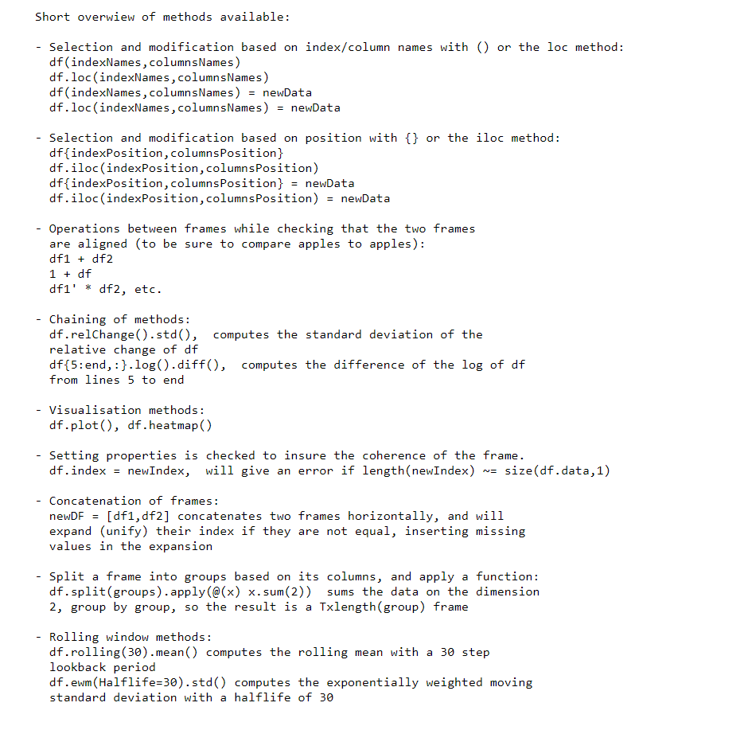
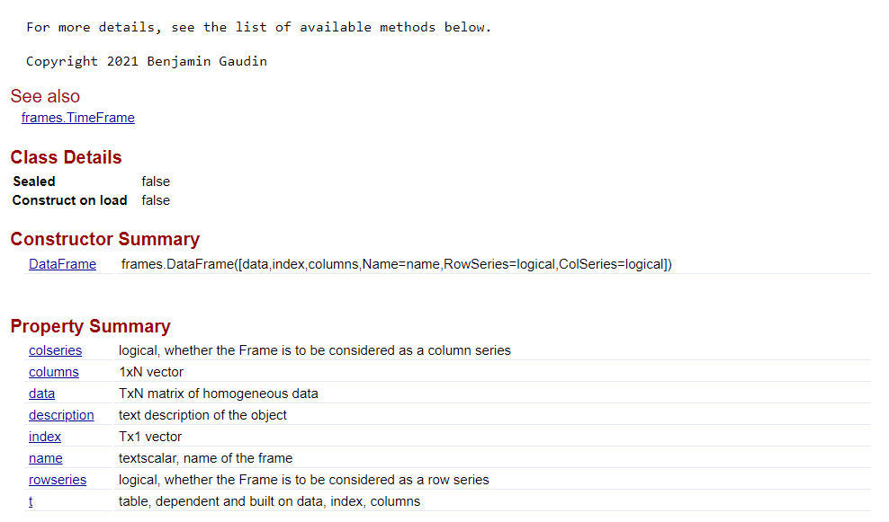
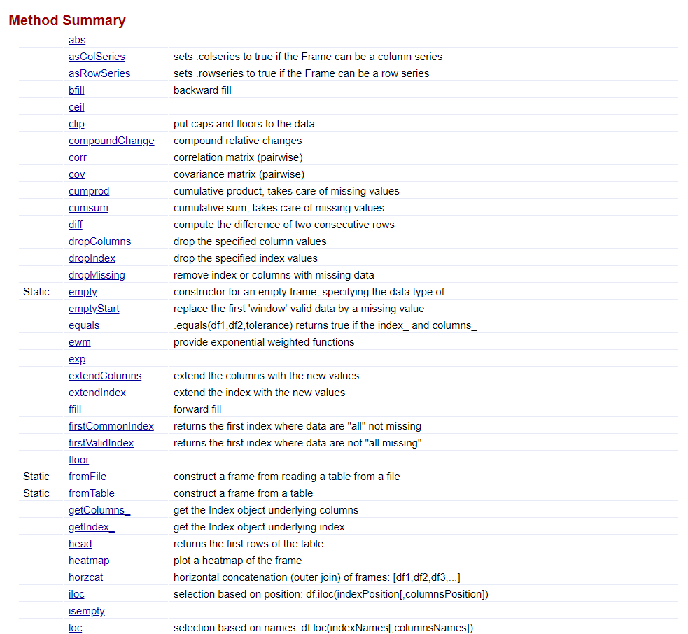
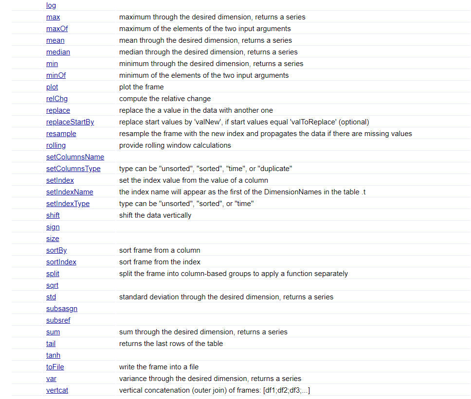

# Frames

## Purpose of the project
**Frames** is a package that introduces a new kind of data type for Matlab.

This data type (or _class_) can help when working with homogeneous data that are referenced by column and index identifiers (like time series which have variable and observation names).

Matlab already has several data types available, but none is well suited for homogeneous, labeled data.

Below are the fundamental data types provided by Matlab together with the new _Frame_.


When one works with data with names for index and columns, one can use a _table_.

However this class does not allow simple operations like addition (table1+table2 is not supported) or operation on data (abs(table) is not available).

If one works directly with the numeric type, one loses the information of the index and column names, risking adding apples to pears.

**_Frame_ aims at being both a matrix and a table**, allowing intuitive operations on and between Frames, while forbidding operations when the Frames are not aligned.
For example, frame1+frame2 is possible, and will fail if indices or columns are misaligned.

There are two types of Frames: DataFrame and TimeFrame, in relation with Matlab's table and timetable.
A DataFrame accepts any kind of index (numeric, string, etc.) while TimeFrame is specifically built to work with a chronological time index (ideal for time series).

## Demo and documentation
A demo is available in [html/framesDemo.html](https://htmlpreview.github.io/?https://github.com/benjamingaudin/Frames/blob/main/html/framesDemo.html) and can be also found in the live script format [framesDemo.mlx](framesDemo.mlx).

The documentation is available using Matlab's command
```Matlab
doc frames.DataFrame
doc frames.TimeFrame
```

The package is compatible with Matlab R2021a and later versions. No other toolbox is required.

The documentation for DataFrame appears as follows:

```Matlab
doc frames.DataFrame
```
<p></p>
<p></p>
<p></p>
<p></p>
<p></p>
